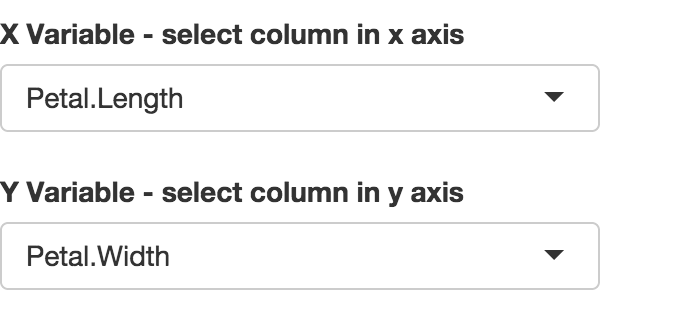

## 1. overview

* use Iris data in R
* select and plot different columns
* select point - just click your mouse on plot
* select area - drag and select all point in that area

--- .class #id 

## 2. choose two column

* all the columns in Iris data have been listed, choose two of them as X and Y axis

--- .class #id 

## 3. get nearest point

* click your mouse on the plot and see nearest point

## 4. get all points in an area

* select an area on the plot and get all points in that area

